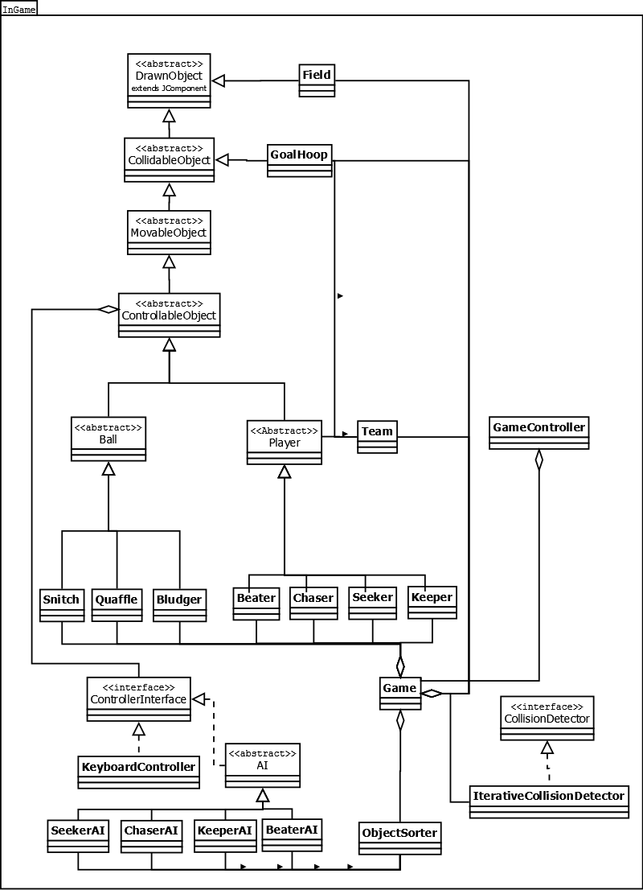
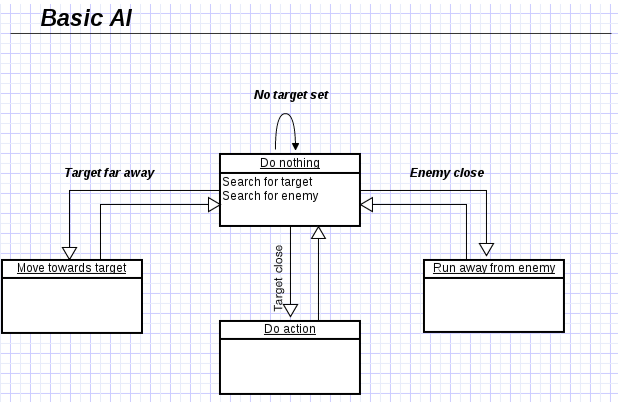

Quidditch Game
==============

A Quidditch game written in Java.

Run Using Netbeans
------------------

1. Open project folder in NetBeans
2. Click 'Build Project'
3. Once built, click 'Run Project'

Run Using Terminal
------------------

1. 'cd' to project root 
2. Type 'ant run'

Class Diagram
-------------

General AI Behaviour
--------------------

Authors
-------
Alex Drinkwater, Andrew Mills, Ashley Stewart, Aydin Arik, Ben Han, Campbell Letts, Chris
Chester, Jimmy Yuan, Matthew Wigley, and Sam Leichter

